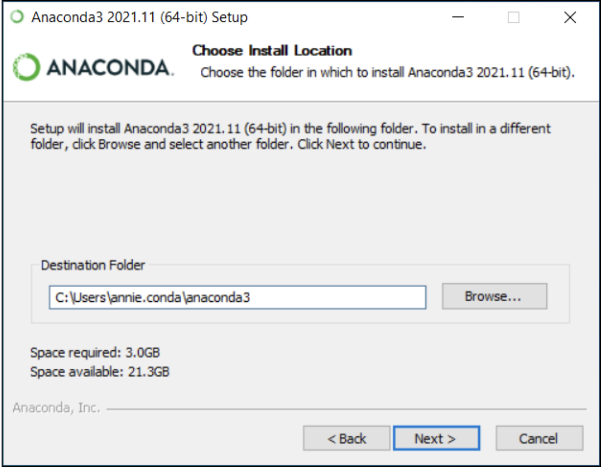
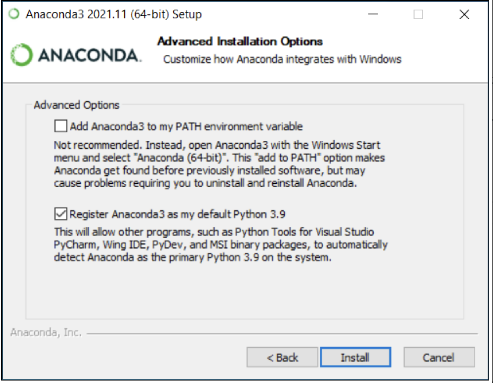
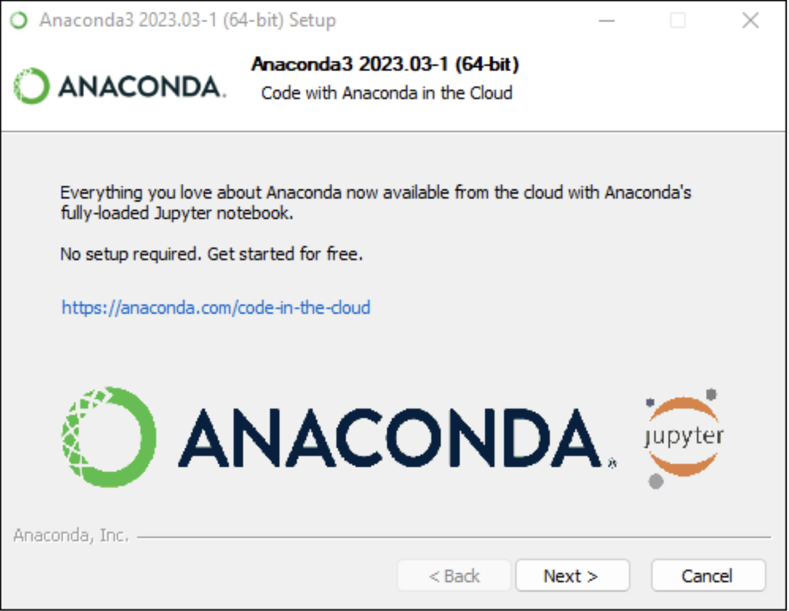
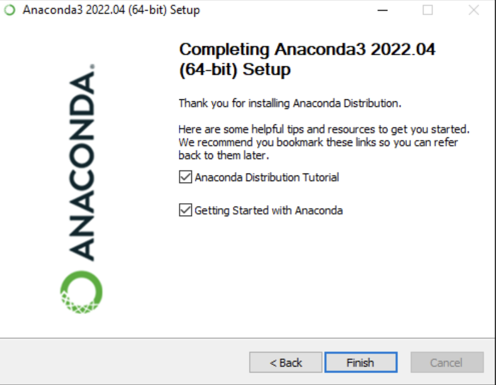
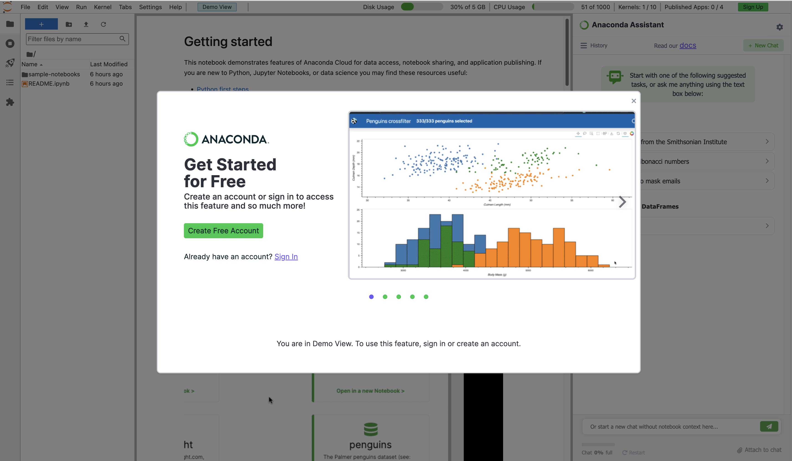
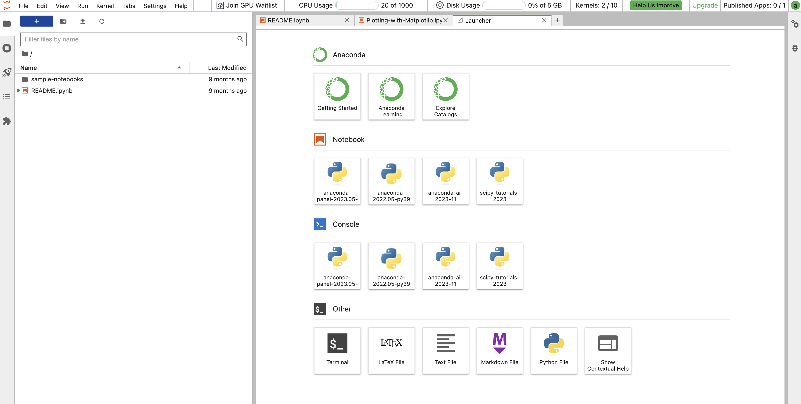

# Python Workshop


## Abstract 
```
In today's data-driven world, researchers are increasingly turning to Python as a powerful tool for data analysis, machine learning, and scientific computing. This comprehensive workshop will guide you through the intricacies of Python, from foundational programming concepts to advanced data analysis libraries for efficient data manipulation and data visualization to create compelling visual representations of your findings. Whether you're a seasoned MATLAB user seeking a more versatile alternative or a complete beginner eager to embark on your Python journey, this workshop will equip you with the skills and knowledge to effectively utilize Python in your research endeavours. It is a hands-on session.
```

# Setup

There are **two** options to setting up your python environment to cater for participants who cannot install apps on their laptop

## Option 1 : Installing Anaconda

Anaconda is available for Windows, Mac OS X, and Linux. Follow the links below to get started:

1. Download the [Anaconda installer](https://repo.anaconda.com/archive/Anaconda3-2023.09-0-Windows-x86_64.exehttps://www.anaconda.com/download/)

2. Go to your Downloads folder and double-click the installer to launch

3. Click **Next**

4. It is recommended that you install for **Just Me**, which will install Anaconda Distribution to just the current user account. 

5. Click **Next**

6. Select a destination folder to install Anaconda and click **Next**. Install Anaconda to a directory path that does not contain spaces or unicode characters. 



7. Choose whether to add Anaconda to your PATH environment variable or register Anaconda as your default Python. We don’t recommend adding Anaconda to your PATH environment variable, since this can interfere with other software.


8. Click **Install**.

9. Click Next.



10 After a successful installation you will see the “Thanks for installing Anaconda” dialog box:



11. Click **finish**

12. Verify installation

    - Windows: `Click Start` > search for `Anaconda Prompt` > click to open.

    - macOS:   Use `Cmd+Space` to open Spotlight Search and type “Navigator” to open the program.
    - run `conda install pip`

13. Open jupyter notebook

    - run in terminal `jupyter notebook`


## Option 2 : Anaconda cloud
If you prefer not to install anything on your machine, you can use anaconda from the cloud


1. Create a free account or login in you already have one.



2. Click new notebook
